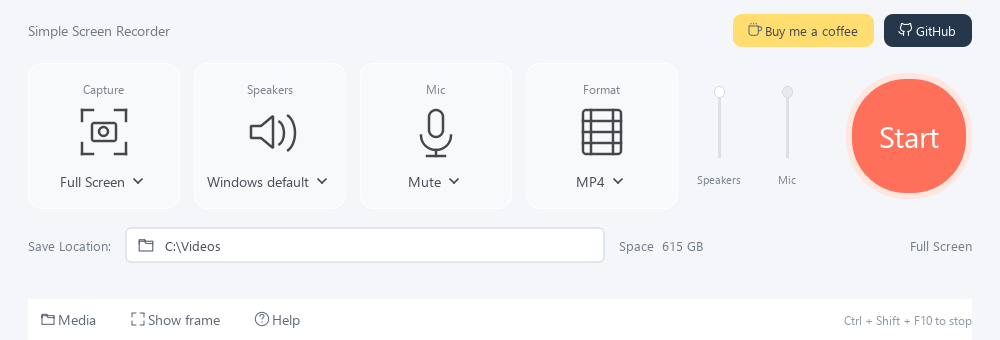

# Simple Screen Recorder

A compact, local Windows screen recorder with a movable recording frame. Ideal for recording a small CCTV picture or a whole monitor.



## Features

- Compact Capture, Speakers, Mic and Format cards with a round Start/Stop button.
- The capture dropdown lists **Full Screen 1**, **Full Screen 2**, etc. for connected monitors, plus **Record all screens** when multiple monitors are connected, followed by **Area**. With one monitor it offers **Full Screen** and **Area**. Screen numbers appear at the top of each monitor while preparing full-screen capture, and disappear before recording. The list updates when monitors are connected or disconnected.
- **Record all screens** saves one combined video preserving the positions, sizes and offsets in Windows display settings. Gaps in the layout appear black. Each monitor shows its own countdown before capture begins.
- **Area** shows a floating recording frame. The frame is a thin red dashed border with a central four-way move handle. Drag anywhere inside it to move between monitors; drag edges or corners to resize it.
- Before recording, the whole clear centre can be dragged to position the frame. During recording, it passes mouse clicks through to your application. Only the area inside the frame is recorded; the border remains outside it. The central instruction and move handle disappear before recording starts.
- MP4, MKV, AVI or WebM output at 30 FPS.
- **Speakers** defaults to the current Windows playback device, resolved afresh for each recording. **Mic** defaults to **Mute** and lists connected Windows input devices. Record speakers and a microphone together, either one alone, or a silent video. Each has its own recording-volume slider. The device lists refresh when opened.
- Click the bordered path beside **Save Location:** to choose a save location. **Media** opens that folder.
- A large 3-2-1 countdown appears over the selected capture area, then disappears before recording starts. The toolbar minimises while recording, and the frame locks to keep capture dimensions consistent.
- Stop with **Ctrl + Shift + F10**, the recorder's Stop button.
- After **Stop**, a themed **Review & export** window opens with video playback and a filmstrip timeline. Drag the yellow handles to trim the beginning/end, or use the exact start/end times. Enable **Crop picture** to resize or move a crop box over the preview. Choose MP4, MKV, AVI or WebM and click **Export video**.
- **Keep original**, or closing the export window, saves the full recording as MP4. Exports preserve audio. Existing videos are never overwritten.
- Timestamped filenames and elapsed recording time.
- Temporary footage is retained for recovery if final saving fails.

## Download

Download **Simple-Screen-Recorder-1.1.2.exe** from the [latest release](https://github.com/B1GM4NT1NGS/Simple-Screen-Recorder/releases/latest). No installation or Python is required.

## Run from source

Requires Windows 10/11, 64-bit Python 3.11 or newer, and internet access for initial dependency installation.

Download and extract the source ZIP, then double-click **Run Simple Screen Recorder.cmd**. This creates a local virtual environment and installs dependencies. Alternatively:

```console
python -m pip install -r requirements.txt
python simple_screen_recorder.py
```

For CCTV: select **Area**, move and resize the frame around the picture, choose an audio source if needed, choose the save location and preferred export format, and press Start. Stop to preview, trim, crop and export the result. Keep the CCTV picture visible and uncovered. Move or resize the frame before starting each recording.

Protected video and some hardware-rendered applications may appear black; test a short clip before an important recording. Windows default captures whichever playback device Windows currently uses; you can choose a specific device instead. Speaker and microphone tracks are mixed into one audio track, with their independent volume settings. Audio starts enabled for the Windows default device. Recording uses temporary disk space in addition to the output file. Keep the computer awake while recording.

Settings are stored under `%APPDATA%/SimpleScreenRecorder`. No recordings are uploaded. The donation and GitHub buttons open their pages only when clicked.

## Optional standalone build

```console
python -m pip install pyinstaller
python build_portable.py
```

The single-file executable appears in `dist`. Python is not required on the destination computer. Download the portable executable from the [latest release](https://github.com/B1GM4NT1NGS/Simple-Screen-Recorder/releases/latest).

## Verification

```console
python -m unittest discover -s tests
```

## Code signing policy

The project is applying to the SignPath Foundation for free open-source signing. Approval is pending and current downloads remain unsigned. See the [code signing policy](SIGNING.md) for the planned SignPath provider, maintainer roles and build verification, and the [privacy policy](PRIVACY.md) for local recording and data handling.

The [Windows build workflow](.github/workflows/windows-build.yml) runs checks and builds unsigned executable artifacts on GitHub-hosted runners. Production signing will be enabled only after approval and configuration.

## Support

If this software helped you, [buy me a coffee](https://buymeacoffee.com/bigzz).

MIT-licensed application. See [THIRD_PARTY.md](THIRD_PARTY.md) for dependency notices.
